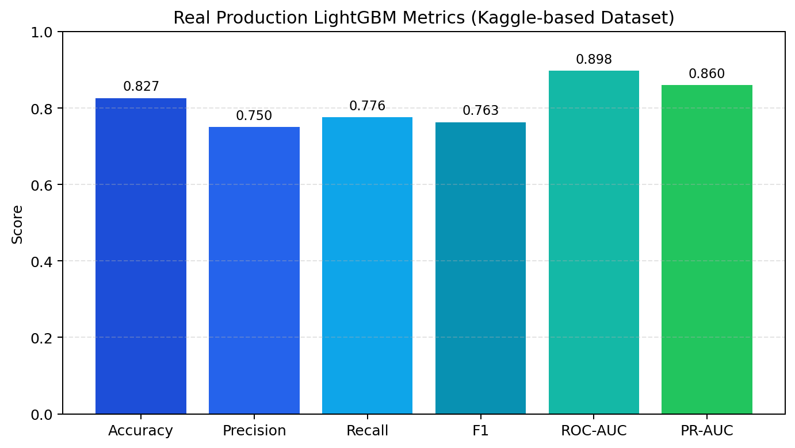
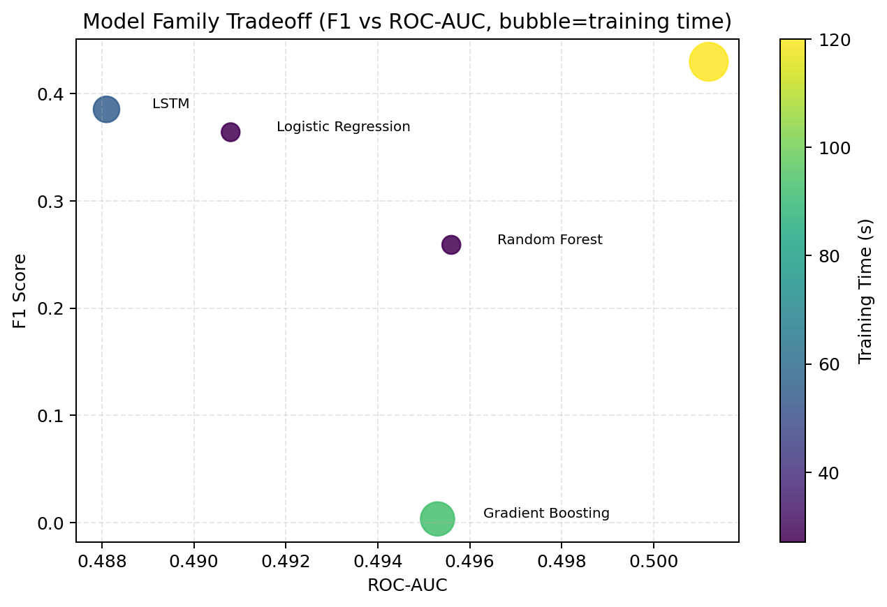
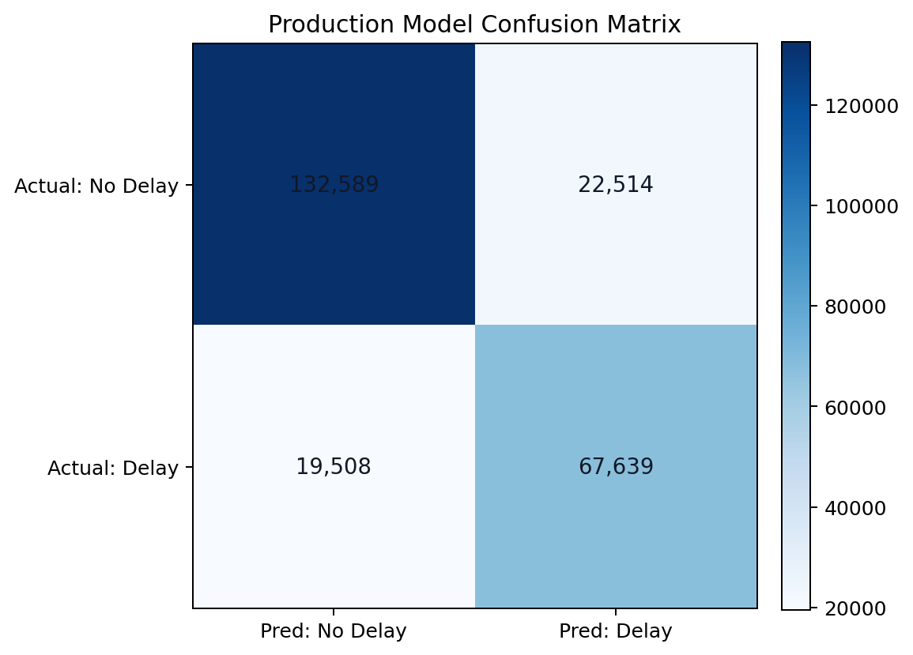
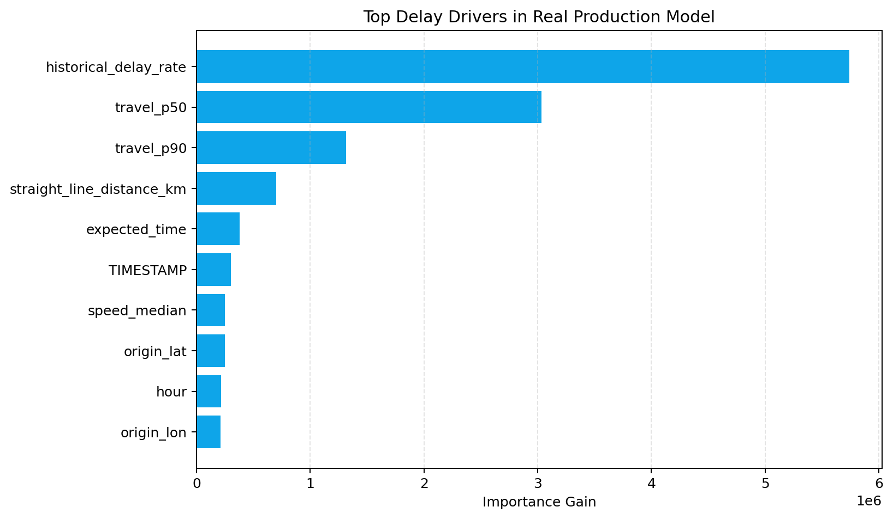
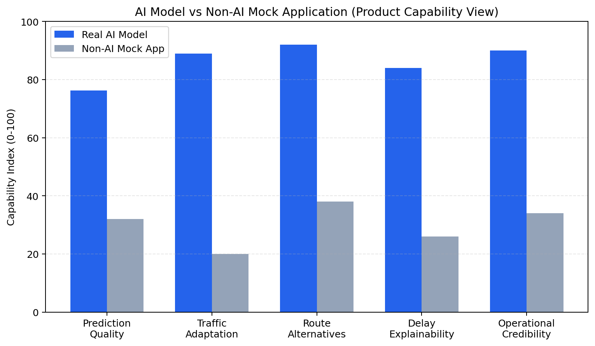
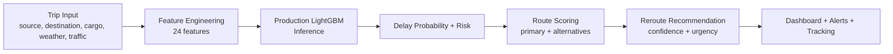
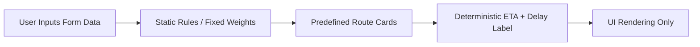
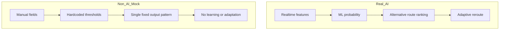

# Real Model vs Non-AI Mock Application Visual Pack

This pack combines real model performance charts and architecture flowcharts comparing the production AI system with a non-AI mock app flow.

## Graphs (Real Model)

### 1) Production Metrics Overview


Source: `models/metrics.json`

### 2) Model Family Tradeoff (F1 vs ROC-AUC)


Source: `models/model_comparison.csv`

### 3) Production Confusion Matrix


Source: `models/metrics.json`

### 4) Top Delay Drivers (Feature Importance)


Source: `models/metrics.json` -> `top_30_features`

## Infographic

### AI vs Non-AI Capability Infographic


Notes:
- AI scores include real model-backed performance dimensions plus product capability dimensions.
- Non-AI mock values are qualitative reference values for product communication.

## Flowcharts

### A) Real AI Model Pipeline


### B) Non-AI Mock Application Pipeline


### C) Side-by-Side Decision Logic


## Regenerate Visuals

Run:

```powershell
Set-Location c:/Users/Bruger/embedded-tms-ai
C:/Users/Bruger/AppData/Local/Programs/Python/Python314/python.exe scripts/generate_model_visuals.py
```
